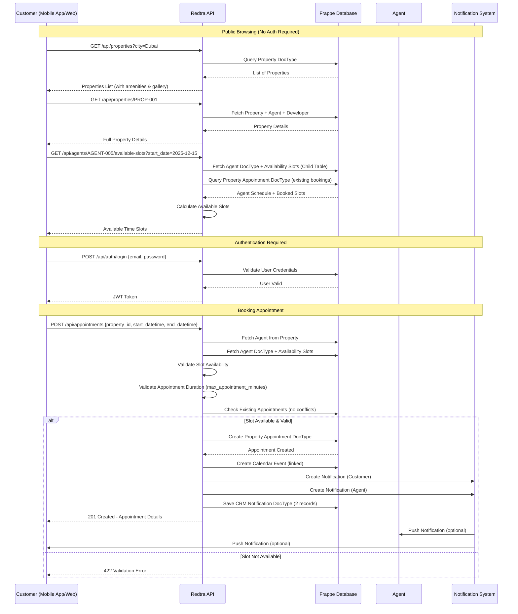
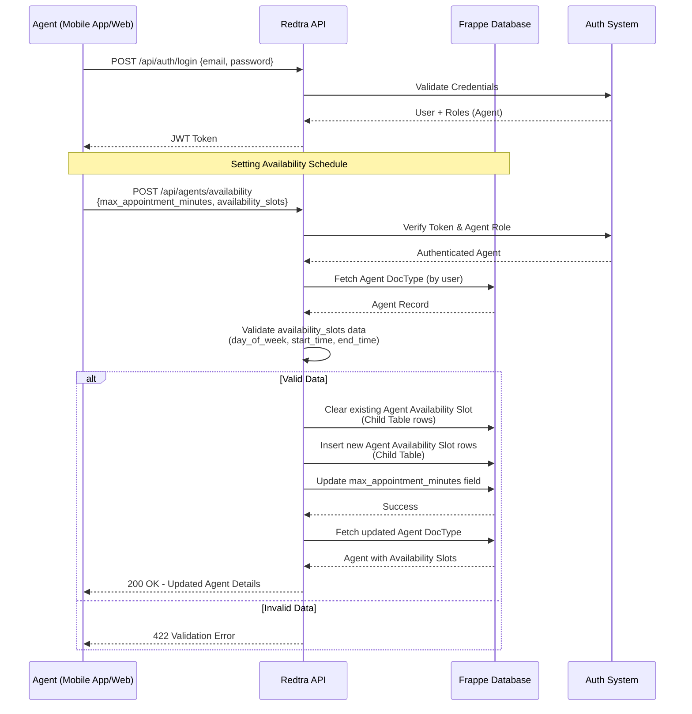
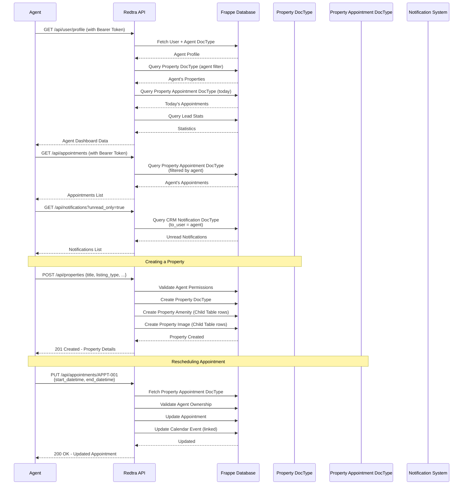
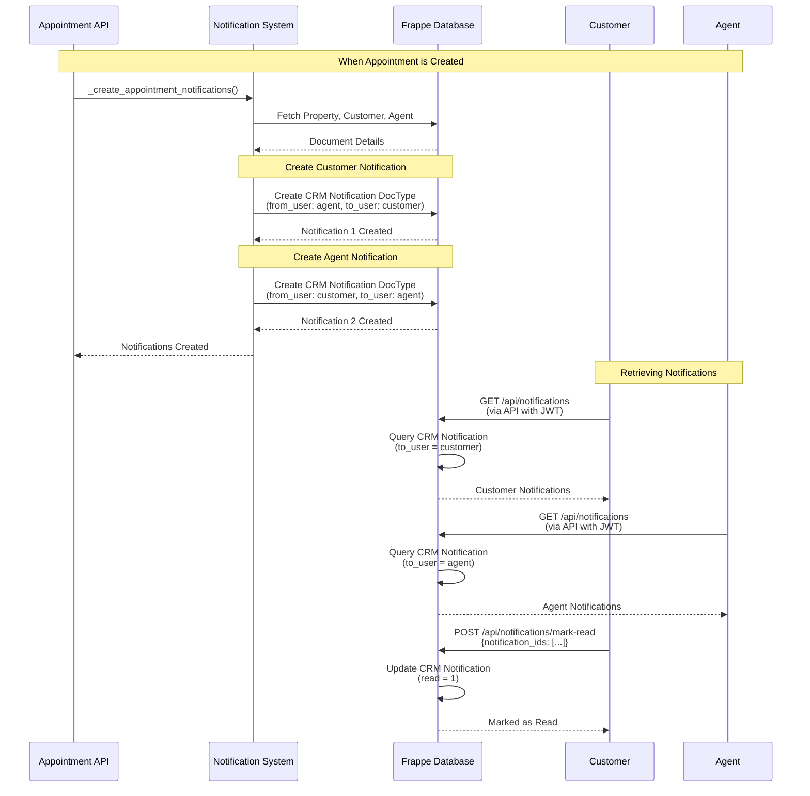
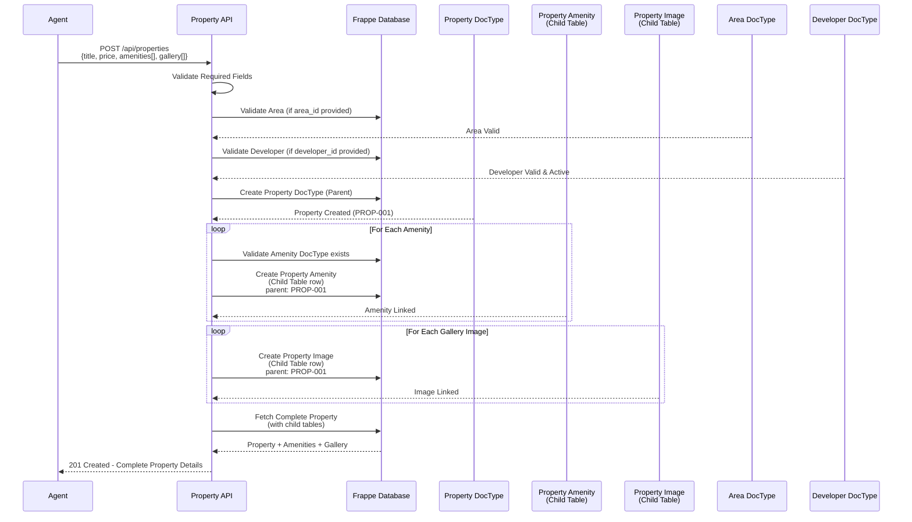
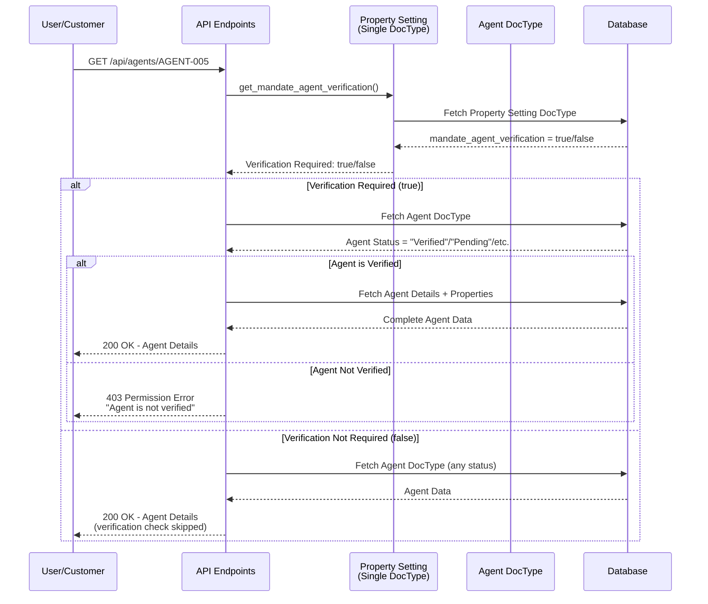
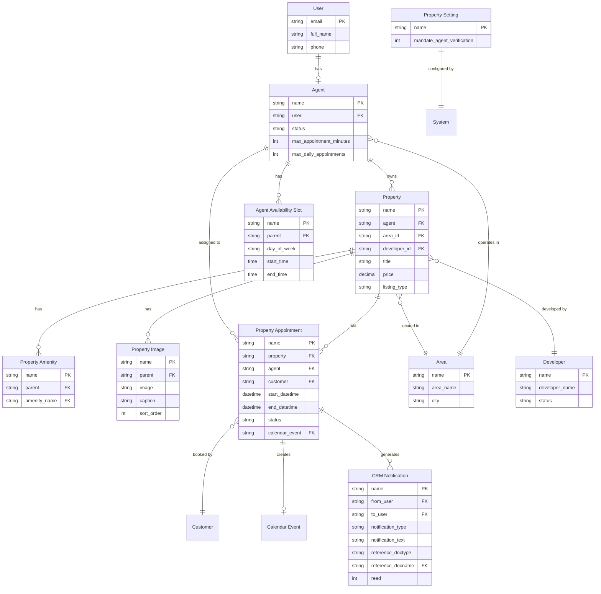

# Redtra API - Sequence Diagrams

Visual representations of API workflows and doctype interactions. These diagrams help developers understand the flow of data and operations in the Redtra Property Booking System.

## Table of Contents

1. [Customer Browsing and Booking Appointment](#1-customer-browsing-and-booking-appointment-flow)
2. [Agent Setting Up Availability](#2-agent-setting-up-availability-flow)
3. [Agent Managing Appointments and Properties](#3-agent-managing-appointments-and-properties-flow)
4. [Notification System](#4-notification-system-flow)
5. [Property Creation with Child Tables](#5-property-creation-with-child-tables-flow)
6. [Agent Verification Check](#6-agent-verification-check-flow)
7. [Doctype Relationships](#7-doctype-relationships-overview)

---

## 1. Customer Browsing and Booking Appointment Flow

This diagram shows the complete flow when a customer browses properties and books an appointment.



**Key Points:**
- Properties and agent availability can be viewed without authentication
- Appointment booking requires authentication
- Appointments validate against agent's availability schedule and existing bookings
- Notifications are automatically created for both customer and agent

---

## 2. Agent Setting Up Availability Flow

This diagram shows how an agent configures their weekly availability schedule.



**Key Points:**
- Agents authenticate first
- Availability slots are stored in a child table (`Agent Availability Slot`)
- Existing slots are replaced (not merged) when updating
- Each slot defines: day of week, start time, end time
- `max_appointment_minutes` defines the duration for appointment slots

---

## 3. Agent Managing Appointments and Properties Flow

This diagram shows how an agent manages their appointments and properties.



**Key Points:**
- Agent dashboard aggregates data from multiple doctypes
- Properties include child tables (Amenities, Images)
- Appointments can be rescheduled by the agent
- Calendar events are automatically maintained

---

## 4. Notification System Flow

This diagram details how notifications are created and retrieved.



**Key Points:**
- Notifications are created automatically when appointments are booked
- Two notifications are created: one for customer, one for agent
- Notifications reference the appointment document
- Users can mark notifications as read

---

## 5. Property Creation with Child Tables Flow

This diagram shows how property creation works with child tables (Amenities, Gallery).



**Key Points:**
- Property is created first (parent document)
- Child tables (Amenities, Gallery) are created separately
- Each child table row references the parent property
- The complete property with child tables is returned

---

## 6. Agent Verification Check Flow

This diagram shows how the conditional agent verification works.



**Key Points:**
- Verification check is controlled by a system setting
- When enabled, only verified agents are accessible
- When disabled, all agents are accessible regardless of status
- Applies to: Get Agent, Get Available Slots, Create Appointment

---

## 7. Doctype Relationships Overview

This diagram shows the relationships between different doctypes in the system.



**Legend:**
- `||--o|` : One-to-One relationship
- `||--o{` : One-to-Many relationship
- `PK` : Primary Key
- `FK` : Foreign Key

---

## Key Doctype Structures

### Property Appointment DocType

```
Property Appointment (Parent)
├── property (Link: Property) - Required
├── agent (Link: Agent) - Required
├── customer (Link: Customer) - Required
├── start_datetime (Datetime) - Required
├── end_datetime (Datetime) - Required
├── status (Select) - Default: "Scheduled"
├── notes (Text)
└── calendar_event (Link: Event) - Auto-created
```

### Agent DocType

```
Agent (Parent)
├── user (Link: User) - Required
├── status (Select) - "Pending", "Verified", "Rejected"
├── max_appointment_minutes (Int) - Default: 30
├── max_daily_appointments (Int) - Default: 10
└── availability_slots (Child Table)
    └── Agent Availability Slot
        ├── day_of_week (Select) - Required
        ├── start_time (Time) - Required
        └── end_time (Time) - Required
```

### Property DocType

```
Property (Parent)
├── title (Data) - Required
├── agent (Link: Agent) - Required
├── listing_type (Select) - Required
├── property_type (Select) - Required
├── price (Currency) - Required
├── amenities (Child Table)
│   └── Property Amenity
│       └── amenity_name (Link: Amenity)
└── gallery (Child Table)
    └── Property Image
        ├── image (Attach Image)
        ├── caption (Data)
        └── sort_order (Int)
```

---

## Workflow Summary

### Customer Journey
1. Browse properties (public) → View details → Check agent availability
2. Login/Register → Select time slot → Book appointment
3. Receive notification → View appointments → Manage favorites

### Agent Journey
1. Login → Set availability schedule → Create properties
2. View appointments → Receive notifications → Manage dashboard
3. Update property details → Reschedule appointments

---

## Diagram Tools

These diagrams are in Mermaid format and can be rendered in:
- GitHub (native support)
- GitLab (native support)
- Markdown viewers with Mermaid support
- VS Code with Mermaid extension
- Online: https://mermaid.live/

To convert to images or other formats, use:
- Mermaid CLI: `mmdc -i diagram.mmd -o diagram.png`
- Online converters available

---

**For detailed API documentation, refer to `DEVELOPER_GUIDE.md`**
